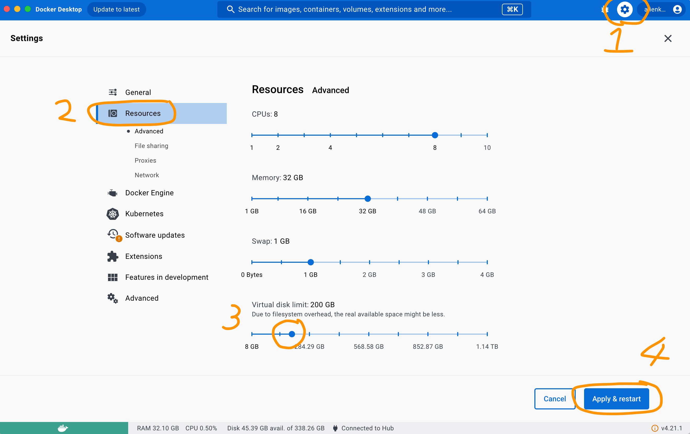
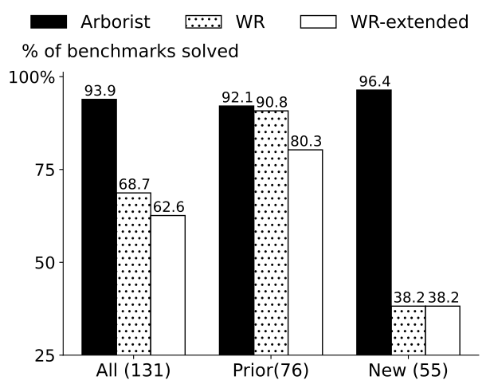
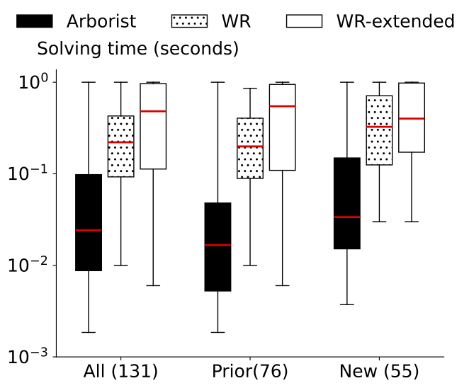
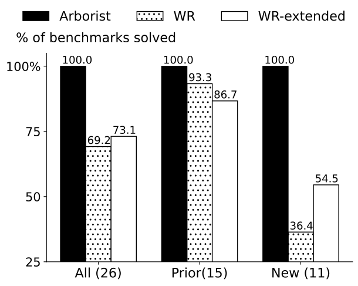
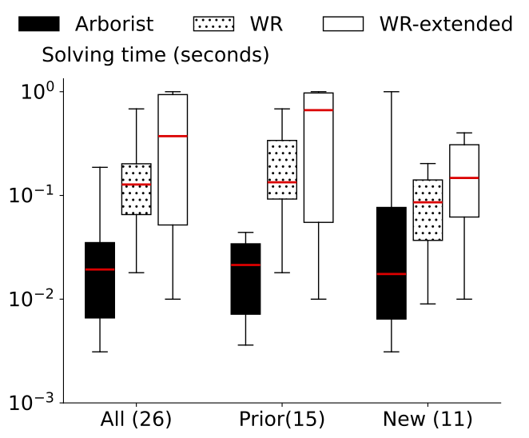
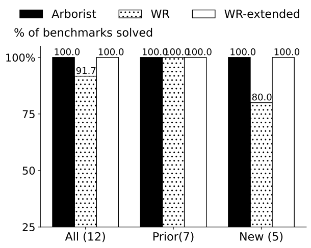
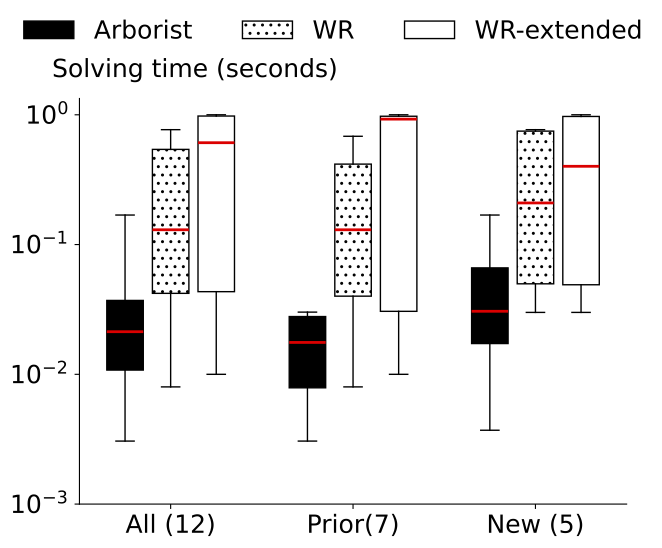

# Overview
In this artifact, we included the implementation of our web automation program synthesizer called Arborist. We will evaluate its efficiency in synthesizing programs for challenging web automation tasks and compare it with state-of-the-art techniques. In the following, we first present benchmarks we used in our evaluation, then show instructions to reproduce our experiment.

# Benchmarks
We collected 131 real-world benchmarks on web-automation tasks, with each benchmark stored in a folder with name WxTx. Each benchmark contains the following files/folder:

- *.program: the ground truth web automation program.
- script.py: the selenium program used to record the action trace and doms of the simulated user interactions on the doms.
- trace.json: the json file contains a list of actions for completing the benchmark task. Each action contains its type, corresponding selectors, and the data if applicable.
- doms/: the folder contain all website dom indexed from the starting website dom before applying the first action to the last website dom after applying the last action.

# Evaluation Instructions
We packaged all code and data into a cross-platform Docker container that works for both x86 and arm host machines. You do not need to download the Zenodo repository as our Docker container published on the Docker Hub contains everything you need. We will show you detailed steps on how to obtain and run that container in the Run Main Experiment section.

Since the full dataset is very large, we also offer small and tiny versions for testing. We automatically generated the smaller versions by randomly sampling x% of prior benchmarks and x% of new benchmarks to capture the distribution
of our benchmarks. However, due to the smaller sample sizes, the resulting graphs may look quite different from that of the full version
we published in the paper. **We recommend that you pick the version that suits your device's storage capacity.** Here are the specification for the full, small, and tiny versions:

| Version | Container Size | Docker Virtual Disk Limit | % Prior Benchmarks | # Prior Benchmarks | % New Benchmarks | # New Benchmarks |
| ------- | -------------- | ------------------------- | ------------------ | ------------------ | ---------------- | ---------------- |
| Full    | 8.4GB          | >=88GB                    | 100                | 76                 | 100              | 55               |
| Small   | 4GB            | >=32GB                    | 20                 | 15                 | 20               | 11               |
| Tiny    | ???            | ???                       | 10                 | 7                  | 10               | 5               |

## Setup Docker Desktop
1. Install Docker Desktop if you haven't already from https://www.docker.com/products/docker-desktop/

2. Set the "Docker Virtual Disk Limit" value to be at least the minimum listed in the table above for the container version you are using.
   Go to Settings -> Resources -> Virtual Disk Limit and drag the slider to the desired value. Hit Apply & Restart to apply the changes.



## Run Main Experiment
1. Pull and run the docker container for arborist. Use the command for your container version.
    * Full version:
    ```
    docker run -ti alienkevin/arborist
    ```
    * Small version:
    ```
    docker run -ti alienkevin/arborist-small
    ```
    * Tiny version:
    ```
    docker run -ti alienkevin/arborist-tiny
    ```

2. **In your container's terminal**, unzip test folder
    ```
    mkdir tests
    tar -I pigz -xf tests.tar.gz
    ```
    Ignore warnings like below:
    ```
    tar: Ignoring unknown extended header keyword 'SCHILY.fflags'
    tar: Ignoring unknown extended header keyword 'LIBARCHIVE.xattr.com.apple.FinderInfo'
    tar: Ignoring unknown extended header keyword 'LIBARCHIVE.xattr.com.apple.lastuseddate#PS'
    ...
    ```

3. **In your container's terminal**, run the main experiment
    ```
    make main
    ```
    For the full version, the main experiment takes around 40 minutes wall-clock time on an M1 Max MacBook Pro. Smaller versions generally run much faster.

4. **In your container's terminal**, plot the experiment results
    ```
    python plot.py
    ```
    Depending on which container version you choose, you will see different graphs. Here are the outputs that you can expect for each version produced by an M1 Max Macbook Pro. Note that the outputs depend on your machine's processing power so you may get slightly different results on a faster/slower machine.

<ul>
<li>Full version's expected graphs:
<div style="display: flex;">
    <div style="flex: 1;">
        
    </div>
    <div style="flex: 1;">
        
    </div>
</div>

<li>Small version's expected graphs:
<div style="display: flex;">
    <div style="flex: 1;">
        
    </div>
    <div style="flex: 1;">
        
    </div>
</div>
</li>

<li>Tiny version's expected graphs:
<div style="display: flex;">
    <div style="flex: 1;">
        
    </div>
    <div style="flex: 1;">
        
    </div>
</div>
</li>
</ul>


5. Export results to host machine. (Below steps all happens **on your host machine's terminal**, not the container's terminal)

    a. First get the name of the container running under the NAMES column:
    ```
    $ docker ps
    CONTAINER ID   IMAGE      COMMAND       CREATED          STATUS          PORTS     NAMES
    e705b63f2247   arborist   "/bin/bash"   37 minutes ago   Up 37 minutes             peaceful_hertz
    ```
    Here the name is `peaceful_hertz`.

    b. Then, copy the generated figures from the container to your host machine.
    Here, we show how to copy the figures to the Downloads folder.
    ```
    docker cp peaceful_hertz:/workspace/figures ~/Downloads/figures
    ```

    You should see that the two figures look similar to Figure 16 on page 19 of the paper.

    c. You can also copy the generated result spread sheets to your host machine for inspection.
    ```
    docker cp peaceful_hertz:/workspace/benchmark_summary.csv ~/Downloads/benchmark_summary.csv
    ```

